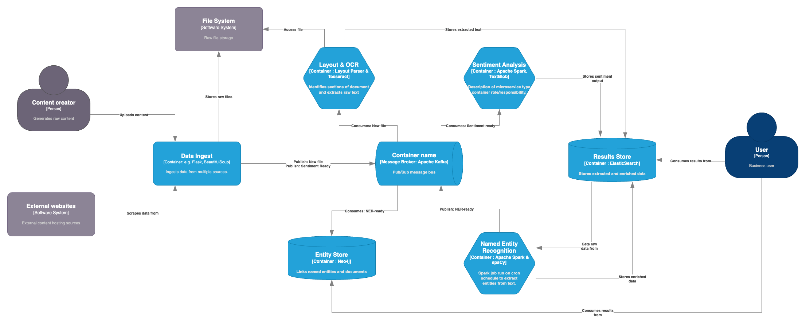
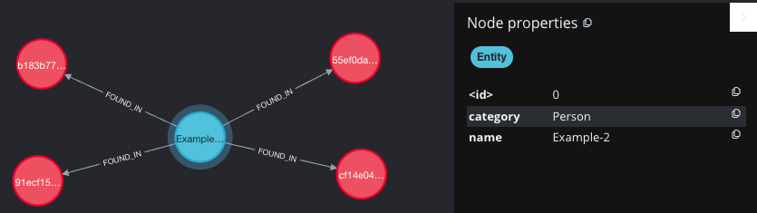

# Document Processing

## Overview

This application process unstructured text and performs Named Entity Recognition and Sentiment Analysis. It 
uses Layout-Parser to perform OCR on documents and Beautiful Soup to scrape data from the web. Spark 
is used to perform the analytics (spaCy for NER and TextBlob for Sentiment) with Kafka routing the messages. 
The named entity recognition output is stored within a Neo4j database and all outputs are stored in ElasticSearch.
This setup has been tested on Apple M2 silicon.

The docker compose will create the following containers:

container|Exposed ports
---|---
upload-api|5050
spark-master|9090
spark-worker-a|9091
spark-worker-b|9092
neo4j|7474 7687
elastic search|9200
kafka|29092
zookeeper|22181
connect|8083
registry|8081

For detailed descriptions please refer to the individual directories. 

## HLD
### System Design
The system design is provided as a C4 container diagram. 



### Data Model

Elastic Search schema for processed documents.
```json lines
{
    "_index": <index name>,
    "_id": <uid>,
    "_source": {
        'Doc_id': <doc_id>,
        'Co-ordinates': {'x1': <x1 cordinate>,
                         'y1': <y1 cordinate>,
                         'x2': <x2 cordinate>,
                         'y2': <y2 cordinate>},
        'Text': <raw text>,
        'Type': <detected block type>,
        'Score': <confidence score>,
        'Processed': <boolean>
}
```



## Installation
The following steps will set up the network and generate example data:

### Pre-requisites
- Docker
- Docker-compose

### Docker compose
To run the network in detached mode use the ```-d``` flag at the end of the command:  
```shell
docker-compose up
```

### Configure Neo4j
Once the network is up and running, POST the configuration file to the kafka-connect 
container. This contains the details of the incoming message and how it is loaded into 
Neo4j. See the [config](neo4j-stream/contrib.sink.string-json.neo4j.json) file for the full 
details but the following lines are highlighted for importance:

```json lines
{
  "name": <name of connector>,
  "config": {
    "topics": <name of subscribed topic>,
    "neo4j.topic.cypher.<name of subscribed topic>": <cypher statement to add new nodes and relationships>
  }
}
```

A [script](neo4j-stream/neo4j_config.sh) has been provided which automates this step.

```shell
./neo4j_config.sh
```

To speed up the ingest process create the following two indexes:
```shell

CREATE CONSTRAINT ON (f:Document) ASSERT f.docID IS UNIQUE;
CREATE INDEX ON :Entity(name);
```

## Validate setup

To validate the setup of the cluster example producer and consumer [scripts](kafka-examples) have been provided. 
Install the virtual environment and run both scripts in separate terminal windows.

```shell
python3 -m venv venv
source venv/bin/activate
pip3 install -r requirements.txt
python3 <name of file>
```

